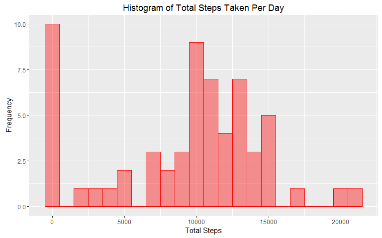
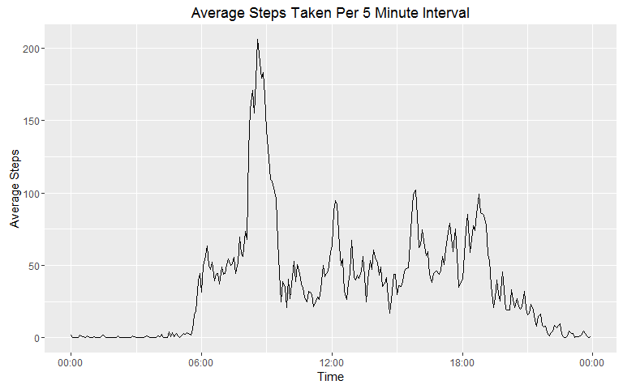
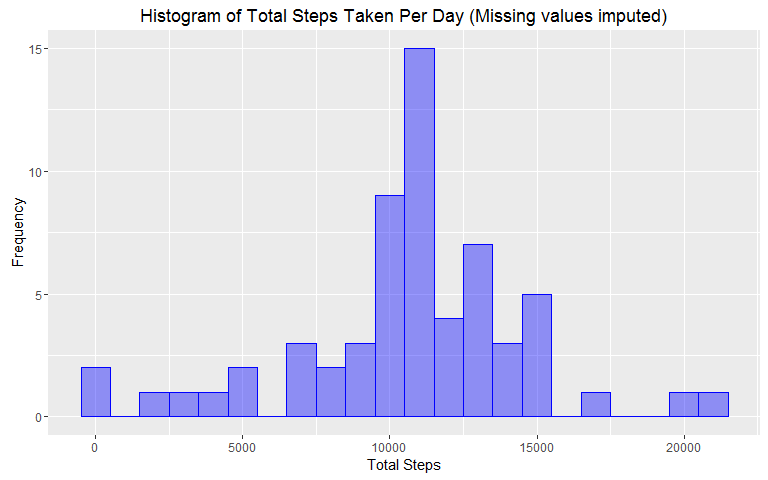
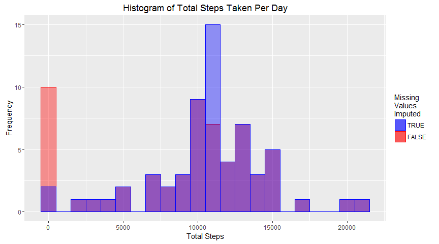
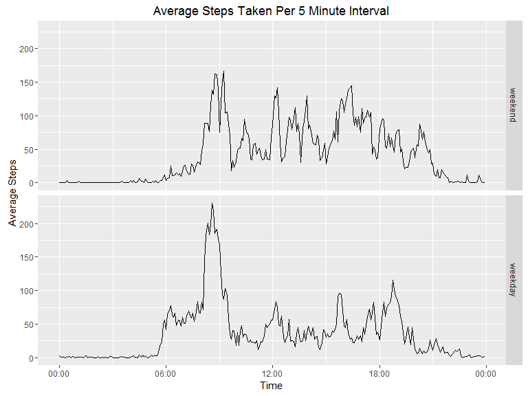
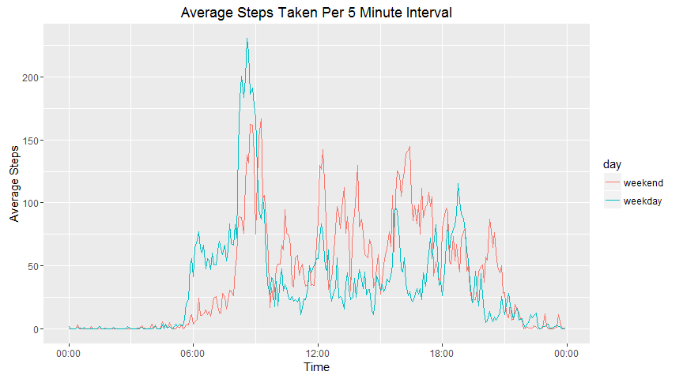

# Reproducible Research - Course Project 1


Introduction
------------

This assignment makes use of data from a personal activity monitoring device. This device collects data at 5 minute intervals through out the day.

### Load all required packages ###

```r
suppressWarnings(library("ggplot2"))
## Using data.table package - faster
suppressWarnings(library("data.table"))
# Better labels with ggplot2 graphs
suppressWarnings(library("scales"))
```


Loading and preprocessing the data
----------------------------------

1. Load the data (i.e. read.csv())
2. Process/transform the data (if necessary) into a format suitable for your analysis


```r
## unzip (in case not already unzipped)
unzip("activity.zip")
## read file
act <- fread("activity.csv", na.string="NA", colClasses = c("integer", "Date", "integer"))
```


What is mean total number of steps taken per day?
-------------------------------------------------

1. Calculate the total number of steps taken per day


```r
sum <- act[, sum(steps, na.rm = T), by=date]    ## Calcualte Sum
setnames(sum, "V1", "steps.sum")                ## name the column
```

2. Make a histogram of the total number of steps taken each day


```r
qplot(steps.sum, data = sum, geom = "histogram", fill = I("red"), col=I("red"), binwidth = 1000, alpha = I(0.4)) +
    labs(title = "Histogram of Total Steps Taken Per Day") +
    labs(x = "Total Steps", y = "Frequency") + 
    theme(legend.position="none")
```



3. Calculate and report the mean and median of the total number of steps taken per day

The mean is **9354.23** (`mean(sum$steps.sum)`) and median is **10395** (`median(sum$steps.sum)`). 


What is the average daily activity pattern?
-------------------------------------------

1. Make a time series plot (i.e. type = "l") of the 5-minute interval (x-axis) and the average number of steps taken, averaged across all days (y-axis)


```r
## Calculate Daily steps
daily <- act[, mean(steps, na.rm = T), by=interval]
setnames(daily, "V1", "Steps")                  ## name the column
## Convert interval to time searies
daily[, Time := as.POSIXct(strptime(formatC(
    daily$interval, width = 4, flag = "0"), format = "%H%M"))]
## Make plot with axis having only time (date removed)
qplot(x = Time, y = Steps, data = daily, geom = "line") +
    scale_x_datetime(labels = date_format(format = "%H:%M")) +
    labs(title = "Average Steps Taken Per 5 Minute Interval") +
    labs(x = "Time", y = "Average Steps")
```



2. Which 5-minute interval, on average across all the days in the dataset, contains the maximum number of steps?

`format.POSIXct(daily$Time[which.max(daily$Steps)], format = "%H:%M")`  
**08:35**


Imputing missing values
-----------------------

1. Calculate and report the total number of missing values in the dataset (i.e. the total number of rows with NAs)

`sum(!complete.cases(act))`  
**2304**

2. Devise a strategy for filling in all of the missing values in the dataset. The strategy does not need to be sophisticated. For example, you could use the mean/median for that day, or the mean for that 5-minute interval, etc.

    - Take only the missing value rows in a different dataset
    - Merge with "daily" to fill the them with daily mean values for that time interval
    - Merge with complete cases (non-NA) data and store as a new dataset  

3.Create a new dataset that is equal to the original dataset but with the missing data filled in.


```r
complete <- complete.cases(act)             ## non-NA indices
## take incomplete (NA) values and replace with 5 minute interval values in a "temp" dataset
temp <- act[!complete][daily, steps:= as.integer(round(i.Steps)), on = "interval"]
## Merge complete activity row with "temp"
act.complete <- rbindlist(list(act[complete], temp))
## Sort new dataset
setkey(act.complete, "date", "interval")
```

4. Make a histogram of the total number of steps taken each day and Calculate and report the **mean** and **median** total number of steps taken per day. Do these values differ from the estimates from the first part of the assignment? What is the impact of imputing missing data on the estimates of the total daily number of steps?


```r
sum.complete <- act.complete[, sum(steps, na.rm = T), by=date]    ## Calcualte Sum
setnames(sum.complete, "V1", "steps.sum")                ## name the column
## Histogram of total number of steps taken each day
qplot(steps.sum, data = sum.complete, geom = "histogram",
      fill = I("blue"), col=I("blue"), binwidth = 1000,
      alpha = I(0.4)) +
    labs(title = "Histogram of Total Steps Taken Per Day (Missing values imputed)") +
    labs(x = "Total Steps", y = "Frequency") +
    theme(legend.position="none")
```



The new (missing values imputed) mean is **10765.64** (`mean(sum.complete$steps.sum)`) and median is **10762** (`median(sum.complete$steps.sum)`).  

The old (missing values **not** imputed) mean is **9354.23** (`mean(sum$steps.sum)`) and median is **10395** (`median(sum$steps.sum)`).  

We can see that the mean and median has been pushed up. This is because when *NA* values are replaced by a value, the mean would push up as days that previously had all/some *NA* would now have a value and thus have higher value. Since the *NA* values were filled with the mean value for that time interval, median also increases. Days with all *NA* values now has an average value any day with some *NA* values also has the total steps increased.  

We can also notice that the mean new mean and median are very close to that of before with sum zero days removed.

Mean:   **10766.19** (`mean(sum[steps.sum != 0,]$steps.sum)`)  
Median: **10765** (`median(sum[steps.sum != 0,]$steps.sum)`)  

This is because days with *NA* has mostly all *NA*s. So removing these days give almost same result. But this will also remove days with genuinely 0 steps as sum.  

These results can be further seen on a plot overlapping data with and without imputing missing values.


```r
## start a plot
overlap <- ggplot()
## add histogram for orginal data with NA values
overlap <- overlap + geom_histogram(data = sum, aes(steps.sum, 
            fill = "r", colour="r"), binwidth = 1000, alpha = 0.4)
## add histogram for dataset with missing values imputed
overlap <- overlap + geom_histogram(data = sum.complete,
            aes(steps.sum, fill = "b", colour="b"),
            binwidth = 1000, alpha = 0.4)
## add labels
overlap <- overlap + 
    labs(title = "Histogram of Total Steps Taken Per Day") +
    labs(x = "Total Steps", y = "Frequency")
## add legend
overlap <- overlap +
    scale_colour_manual(name="Missing\nValues\nImputed",
                        values=c("r" = "red", "b"="blue"),
                        labels=c("b"="TRUE", "r"="FALSE")) +
    scale_fill_manual(name="Missing\nValues\nImputed",
                      values=c("r" = "red", "b"="blue"),
                      labels=c("b"="TRUE", "r"="FALSE"))
## plot
plot(overlap)
```



Are there differences in activity patterns between weekdays and weekends?
----------------------------------------------------------------------

1. Create a new factor variable in the dataset with two levels – “weekday” and “weekend” indicating whether a given date is a weekday or weekend day.


```r
## change date variable to "Date" type (instead of character)
act.complete[, date := as.Date(date)]
## create a column of weekdays
act.complete[, wdays := as.factor(weekdays(date, abbreviate = TRUE))]
## create column as factor of weekend/weekday
act.complete[wdays %in% c("Sat", "Sun"), day := as.factor("weekend")]
act.complete[!wdays %in% c("Sat", "Sun"), day := as.factor("weekday")]
```

2. Make a panel plot containing a time series plot (i.e. type = "l") of the 5-minute interval (x-axis) and the average number of steps taken, averaged across all weekday days or weekend days (y-axis).


```r
## calculate mean steps for each interval separate for weekday/weekend
daily.complete <- act.complete[, mean(steps, na.rm = T),
                               by=.(interval,day)]
setnames(daily.complete, "V1", "Steps")
## Convert interval to time searies
daily.complete[, Time := as.POSIXct(strptime(formatC(
    daily$interval, width = 4, flag = "0"), format = "%H%M"))]
## Plot
qplot(x = Time, y = Steps, data = daily.complete, geom = "line") +
    facet_grid(day ~ .) +
    scale_x_datetime(labels = date_format(format = "%H:%M")) +
    labs(title = "Average Steps Taken Per 5 Minute Interval") +
    labs(x = "Time", y = "Average Steps")
```



Additional overlapping plot to see the difference between weekday and weekend.


```r
qplot(x = Time, y = Steps, data = daily.complete, geom = "line", col = day) +
    scale_x_datetime(labels = date_format(format = "%H:%M")) +
    labs(title = "Average Steps Taken Per 5 Minute Interval") +
    labs(x = "Time", y = "Average Steps")
```



  
  
By: *Akram Faisal*
